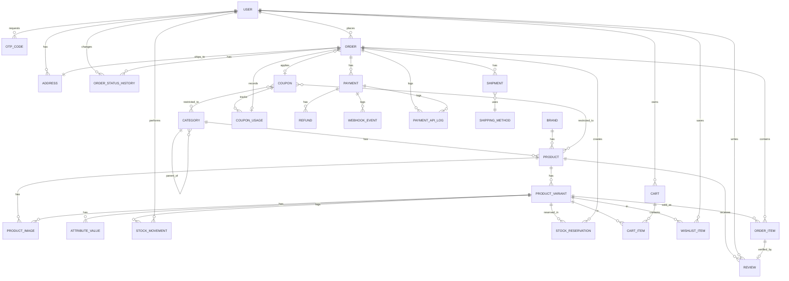

# Technical Design Document
## E-Commerce Platform — Data Model & ERD

**Version:** 1.0
**Companion to:** BRD-ecommerce-platform.md
**Stack:** Laravel + Filament, MySQL/PostgreSQL

---

## 1. Purpose

This document translates the BRD's functional requirements into a concrete data model: entities, fields, types, relationships, and key constraints. It is the direct input for writing Laravel migrations and Eloquent models.

**Deployment model:** this schema is designed to be deployed as a **separate installation per business** (own database, own environment) using a shared, reusable codebase — not as a multi-tenant system. No `tenant_id`/business-scoping columns appear anywhere in this schema, since each installation's data belongs entirely to one business. The only business-specific configuration lives in `store_settings` (Section 3.9), which drives storefront branding.

---

## 2. Entity-Relationship Diagram (Mermaid)



---

## 3. Entity Definitions

### 3.1 Catalog

**categories**
| Field | Type | Notes |
|---|---|---|
| id | bigint PK | |
| parent_id | bigint FK → categories.id, nullable | self-referential, supports subcategories |
| name | string | |
| slug | string, unique | |
| created_at / updated_at | timestamps | |

**brands**
| Field | Type | Notes |
|---|---|---|
| id | bigint PK | |
| name | string | |
| slug | string, unique | |
| logo_path | string, nullable | |
| description | text, nullable | |
| created_at / updated_at | timestamps | |

**products**
| Field | Type | Notes |
|---|---|---|
| id | bigint PK | |
| category_id | bigint FK → categories.id | |
| brand_id | bigint FK → brands.id, nullable | |
| name | string | |
| slug | string, unique | mutated to `{slug}-deleted-{id}` on delete, freeing the original value for reuse — see note below |
| description | text, nullable | |
| meta_title | string, nullable | SEO |
| meta_description | string, nullable | SEO |
| status | enum(active, draft, archived) | |
| deleted_at | timestamp, nullable | soft delete (Laravel `SoftDeletes`) |
| created_at / updated_at | timestamps | |

**product_variants**
| Field | Type | Notes |
|---|---|---|
| id | bigint PK | |
| ulid | string, unique, indexed | external identifier — used in routes/API instead of `id` |
| product_id | bigint FK → products.id | |
| sku | string, unique | mutated to `{sku}-deleted-{id}` on delete, same rule as product slug |
| price | integer | price in pesewas (minor units), e.g. GH₵15.50 → `1550`; formatted via accessor for display |
| stock | int | cached total, derived from stock_movements |
| status | enum(active, inactive) | |
| deleted_at | timestamp, nullable | soft delete |
| created_at / updated_at | timestamps | |

> **Archive vs. Delete — two distinct, deliberate admin actions:**
> - **Archive** (`status: archived`) — "stop selling this, might bring it back." No slug/SKU change, no soft-delete. The simplest, most common action for discontinuing a product.
> - **Delete** (`DeleteProduct` / `DeleteProductVariant` Actions) — soft-deletes the row (`deleted_at` set) so foreign keys from `StockMovement`, `StockReservation`, and `OrderItem` (via `product_variant_id`, kept for convenience linking) remain valid and the inventory audit trail stays intact. Simultaneously mutates `slug`/`sku` to `{original}-deleted-{id}`, using the row's own permanent database ID — which is always unique — so the original slug/SKU is immediately free for a brand new product to reuse, with **no risk of collision even after repeated create → delete → recreate → delete cycles**, since every row's ID is unique forever.
> - Neither action affects any existing `OrderItem.item_snapshot` — past orders always display correctly regardless of a product being edited, archived, or deleted, since they never re-read from the live `Product`/`ProductVariant` tables.

**attribute_values**
| Field | Type | Notes |
|---|---|---|
| id | bigint PK | |
| product_variant_id | bigint FK → product_variants.id | |
| attribute_name | string | e.g. "Size", "Color" |
| value | string | e.g. "Large", "Red" |

**product_images**
| Field | Type | Notes |
|---|---|---|
| id | bigint PK | |
| product_id | bigint FK → products.id | |
| product_variant_id | bigint FK → product_variants.id, nullable | variant-specific image, if applicable |
| path | string | |
| sort_order | int, default 0 | |
| is_primary | boolean, default false | |

---

### 3.2 Inventory

**stock_movements**
| Field | Type | Notes |
|---|---|---|
| id | bigint PK | |
| product_variant_id | bigint FK → product_variants.id | |
| type | enum(sale, restock, adjustment, return, damage) | |
| quantity | int, signed | positive or negative |
| reference_type / reference_id | polymorphic, nullable | e.g. links to Order for sales |
| note | string, nullable | |
| user_id | bigint FK → users.id, nullable | actor; null if system-triggered |
| created_at | timestamp | |

**stock_reservations**
| Field | Type | Notes |
|---|---|---|
| id | bigint PK | |
| product_variant_id | bigint FK → product_variants.id | |
| order_id | bigint FK → orders.id | |
| quantity | int | |
| status | enum(active, fulfilled, released, at_risk) | `at_risk` — see manual adjustment note below |
| expires_at | timestamp | |
| created_at / updated_at | timestamps | |

> **Concurrency note:** Reservation creation must use `lockForUpdate()` on the target variant row within a DB transaction, checking `stock - SUM(active reservations)` before committing, to prevent overselling on simultaneous checkouts.
>
> **Manual stock adjustment vs. active reservations:** the system's stock ledger can become out of sync with physical reality — e.g. damage, miscounted initial entry, shrinkage — which a Store Keeper's physical count corrects. If that correction would make `stock - active reservations` negative (the ledger previously believed there was more stock than physically exists, and reservations were validly created against that belief before the discrepancy was found), the **real-world count always wins**: the adjustment is allowed to proceed. The oldest/excess active reservations that can no longer be covered are marked `at_risk`, and an Admin is notified to resolve them manually (contact customer, cancel, or expedite restock) — the system never silently proceeds as if nothing happened. If an `at_risk` reservation's payment later succeeds anyway, it is handled by the same late-payment-confirmation logic in Section 4d (re-fulfill if stock is actually available by then, else auto-refund).

---

### 3.3 Users & Access

**users**
| Field | Type | Notes |
|---|---|---|
| id | bigint PK | |
| name | string, nullable | may be unset until provided (e.g. right after first OTP login) |
| phone | string, unique when present, nullable | primary identifier for most customers |
| phone_verified_at | timestamp, nullable | set on successful OTP verification |
| email | string, unique when present, nullable | no longer required |
| email_verified_at | timestamp, nullable | set on successful email verification or trusted directly from Google |
| password | string, nullable | only set if the customer opts into the email+password path |
| google_id | string, unique when present, nullable | set on first Google login |
| created_at / updated_at | timestamps | |

> **A user must have at least one of `phone`, `email`, or `google_id`** — enforced in application logic (`RegisterUser`/`VerifyOtp`/`LoginWithGoogle`), not achievable as a single DB constraint given the "at least one of three nullable columns" shape. This table supports three independent login methods converging on one account, detailed in Section 4e.

> Roles/permissions managed via Spatie Laravel Permission package tables (`roles`, `permissions`, `model_has_roles`, etc.) — not custom-modeled here.

**otp_codes**
| Field | Type | Notes |
|---|---|---|
| id | bigint PK | |
| identifier | string | phone number (or email, if that channel is ever enabled) the code was sent to |
| code_hash | string | the 6-digit code is **never stored in plaintext** |
| purpose | enum(login) | extensible if OTP is later used for other flows (e.g. sensitive action confirmation) |
| expires_at | timestamp | 10 minutes from creation |
| consumed_at | timestamp, nullable | one-time use — set immediately on successful verification |
| attempts | int, default 0 | incremented on each failed verification attempt; used for brute-force lockout |
| created_at | timestamp | |

> **Rate limiting (enforced in `RequestOtp`, not just at this table):** max 1 OTP request per phone per 60 seconds, max 5 per hour — since each SMS costs money via Moolre, unrestricted requests are a real cost/abuse vector, not just a security one. **Brute-force protection:** a code is invalidated after 5 failed verification attempts, requiring a fresh request.

**addresses**
| Field | Type | Notes |
|---|---|---|
| id | bigint PK | |
| ulid | string, unique, indexed | external identifier for routes/API |
| user_id | bigint FK → users.id, nullable | nullable for guest addresses tied only to an order |
| label | string, nullable | e.g. "Home", "Office" |
| line_1 / line_2 | string | |
| city | string | |
| region | string | |
| phone | string | |
| is_default | boolean, default false | |

---

### 3.4 Shopping

**carts**
| Field | Type | Notes |
|---|---|---|
| id | bigint PK | |
| user_id | bigint FK → users.id, nullable | null for guest carts |
| session_id | string, nullable | used for guest cart identification |
| created_at / updated_at | timestamps | |

**cart_items**
| Field | Type | Notes |
|---|---|---|
| id | bigint PK | |
| ulid | string, unique, indexed | external identifier for routes/API |
| cart_id | bigint FK → carts.id | |
| product_variant_id | bigint FK → product_variants.id | |
| quantity | int | |

**wishlist_items**
| Field | Type | Notes |
|---|---|---|
| id | bigint PK | |
| ulid | string, unique, indexed | external identifier for routes/API |
| user_id | bigint FK → users.id | |
| product_variant_id | bigint FK → product_variants.id | |
| created_at | timestamp | |

---

### 3.5 Orders

**orders**
| Field | Type | Notes |
|---|---|---|
| id | bigint PK | internal use only — never shown to customers |
| ulid | string, unique, indexed | external identifier for routes/API — distinct from `order_number` (see Section 4f) |
| order_number | string, unique, indexed | customer-facing, human-readable reference, e.g. `ORD-2026-000123`; generated on creation via model observer |
| user_id | bigint FK → users.id, nullable | nullable for guest orders; **never auto-populated from email matching — see note below** |
| guest_email | string, nullable | |
| guest_phone | string, nullable | |
| address_id | bigint FK → addresses.id | shipping address |
| coupon_id | bigint FK → coupons.id, nullable | |
| status | enum(pending, paid, processing, shipped, delivered, cancelled) | |

> **Guest email collision:** if a guest checks out using an email that matches an existing registered account, the order is still stored with `user_id: null` and `guest_email` set — it is never automatically attached to that account. Auto-attaching based on an unverified email match would let anyone link (and potentially view) an order against an account they don't control. A guest can only link a past guest order to their account via `ClaimGuestOrder`, which requires them to actually authenticate as that user first — matching is only ever used to *offer* the claim, never to perform it automatically.
| subtotal | integer | pesewas (minor units) |
| discount_total | integer, default 0 | pesewas |
| tax_total | integer, default 0 | pesewas |
| shipping_total | integer, default 0 | pesewas |
| grand_total | integer | pesewas |
| invoice_path | string, nullable | generated PDF receipt path |
| created_at / updated_at | timestamps | |

**order_items**
| Field | Type | Notes |
|---|---|---|
| id | bigint PK | |
| order_id | bigint FK → orders.id | |
| product_variant_id | bigint FK → product_variants.id | kept for convenience linking back to the live catalog; never read from for display |
| item_snapshot | json | full immutable snapshot, captured once at Order creation (see below) |
| unit_price | integer | pesewas (minor units) at the moment the **Order is created** (checkout), not the price when the item was added to cart |
| quantity | int | |

> **Cart is never a price guarantee.** `unit_price` and `item_snapshot` are populated by `CreateOrderFromCart` by reading the variant's *current* data at the moment the Order is created — regardless of how long the item sat in the cart. Once created, both are permanently fixed for that order and never re-read from the live `Product`/`ProductVariant` tables again, for any reason — not on display, not on PDF regeneration, not after the product is edited, archived, or deleted.
>
> **`item_snapshot` (JSON) contains everything needed to render the line item exactly as it appeared at purchase time**, independent of the live catalog: product name, brand name, SKU, variant attribute values (e.g. size/color), and the primary image path at that time. This is deliberately broader than just price — a product's image, name, or attributes can all change or disappear later without ever affecting how a past order displays.
>
> **Practical effect:** editing a product's price, name, or image today has zero effect on any past order's receipt, invoice, or order-history display — those already read entirely from `item_snapshot`, not from the live product. This holds true even if the product is later archived or deleted entirely.

**order_status_histories**
| Field | Type | Notes |
|---|---|---|
| id | bigint PK | |
| order_id | bigint FK → orders.id | |
| status | string | |
| note | string, nullable | |
| changed_by | bigint FK → users.id, nullable | null if system/webhook-triggered |
| created_at | timestamp | |

---

### 3.6 Payments

**payments**
| Field | Type | Notes |
|---|---|---|
| id | bigint PK | |
| ulid | string, unique, indexed | external identifier for routes/API |
| order_id | bigint FK → orders.id | |
| provider | string | provider key, matches config/payments.php — not a fixed enum, since providers are pluggable |
| provider_reference | string | |
| channel | string, nullable | e.g. mobile_money, card, bank_transfer |
| amount | integer | pesewas (minor units) — matches Paystack/Moolre's native minor-unit APIs, no conversion needed at the boundary |
| currency | string, default 'GHS' | |
| status | enum(pending, success, failed) | |
| metadata | json, nullable | raw callback payload |
| created_at / updated_at | timestamps | |

**refunds**
| Field | Type | Notes |
|---|---|---|
| id | bigint PK | |
| ulid | string, unique, indexed | external identifier for routes/API |
| payment_id | bigint FK → payments.id | |
| amount | integer | pesewas (minor units); must not exceed the original payment's `amount` |
| status | enum(pending, success, failed) | |
| provider_refund_reference | string, nullable | |
| reason | string, nullable | |
| created_at / updated_at | timestamps | |

**payment_api_logs**
| Field | Type | Notes |
|---|---|---|
| id | bigint PK | |
| order_id | bigint FK → orders.id | always present, even before a Payment record exists |
| payment_id | bigint FK → payments.id, nullable | attached once a Payment record exists |
| provider | string | provider key, matches config/payments.php — not a fixed enum, since providers are pluggable |
| action | string | e.g. `initiate`, `verify`, `refund` |
| request_payload | json | |
| response_payload | json, nullable | |
| status_code | int, nullable | |
| created_at | timestamp | |

> Logs every **outbound** API call this system makes to Moolre/Paystack (and their responses) — distinct from `webhook_events`, which logs **inbound** async notifications. Together with `payments`/`refunds`, these three give a complete per-order trace: what we sent, what they sent back synchronously, and what they later confirmed via webhook.

**webhook_events**
| Field | Type | Notes |
|---|---|---|
| id | bigint PK | |
| provider | string | provider key, matches config/payments.php — not a fixed enum, since providers are pluggable |
| event_id | string | provider's event identifier, for idempotency |
| payload | json | |
| verified | boolean, default false | true only if signature check passed; unverified events are logged but never processed |
| processed_at | timestamp, nullable | |
| created_at | timestamp | |

---

### 3.7 Marketing

**coupons**
| Field | Type | Notes |
|---|---|---|
| id | bigint PK | |
| ulid | string, unique, indexed | external identifier for routes/API |
| code | string, unique | |
| type | enum(percentage, fixed, free_shipping) | |
| value | integer, nullable | for `fixed` type: pesewas (minor units). For `percentage`: whole-number percent (e.g. `10` = 10%), not minor units — not required for `free_shipping` |
| min_order_amount | integer, nullable | pesewas |
| usage_limit | int, nullable | |
| usage_limit_per_user | int, nullable | |
| expires_at | timestamp, nullable | |
| active | boolean, default true | |

**coupon_product** (pivot) — `coupon_id`, `product_id`
**coupon_category** (pivot) — `coupon_id`, `category_id`

**coupon_usages**
| Field | Type | Notes |
|---|---|---|
| id | bigint PK | |
| coupon_id | bigint FK → coupons.id | |
| order_id | bigint FK → orders.id | |
| user_id | bigint FK → users.id, nullable | nullable for guest orders |
| guest_email | string, nullable | used to enforce `usage_limit_per_user` for guests, matched by email |
| created_at | timestamp | |

> Records every actual use of a coupon (order creation, not just cart-time preview). `usage_limit` is enforced by counting rows against `coupon_id`; `usage_limit_per_user` is enforced by counting rows against `coupon_id` + `user_id` (or `guest_email` for guests). Recording a usage and validating the limit happen inside the same DB transaction with a row lock on the `Coupon` record, using the same pattern as stock reservation (Section 4a/4c), to prevent two simultaneous checkouts both passing validation on the last available use.

**reviews**
| Field | Type | Notes |
|---|---|---|
| id | bigint PK | |
| ulid | string, unique, indexed | external identifier for routes/API |
| product_id | bigint FK → products.id | |
| user_id | bigint FK → users.id | |
| order_item_id | bigint FK → order_items.id | proof of purchase |
| rating | tinyint (1–5) | |
| title | string, nullable | |
| body | text | |
| status | enum(pending, approved, rejected) | reset to `pending` whenever the customer edits rating/title/body |
| deleted_at | timestamp, nullable | soft delete — customer may delete their own review anytime |
| created_at / updated_at | timestamps | |

> **Edit/delete policy:** the review's author may edit their own rating/title/body at any time — doing so always resets `status` to `pending`, requiring re-moderation before the updated content is publicly visible again (closes the loophole of getting approved with one version, then editing to something else). The author may also delete their own review at any time (soft delete). **Admins may delete a review (moderation power) but may never edit its content** — only the original author's own words are ever displayed under their name.

---

### 3.8 Fulfillment

**shipping_methods**
| Field | Type | Notes |
|---|---|---|
| id | bigint PK | |
| name | string | |
| cost | integer | pesewas (minor units) |
| active | boolean, default true | |

**shipments**
| Field | Type | Notes |
|---|---|---|
| id | bigint PK | |
| ulid | string, unique, indexed | external identifier for routes/API |
| order_id | bigint FK → orders.id | |
| shipping_method_id | bigint FK → shipping_methods.id | |
| tracking_number | string, nullable | |
| status | enum(pending, dispatched, delivered) | |
| dispatched_at | timestamp, nullable | |
| delivered_at | timestamp, nullable | |

---

### 3.9 Store Settings & Branding

**store_settings** (single-row table, or key-value via `spatie/laravel-settings`)
| Field | Type | Notes |
|---|---|---|
| id | bigint PK | |
| business_name | string | |
| logo_path | string, nullable | |
| primary_color | string, nullable | hex value, drives storefront theme CSS variable |
| secondary_color | string, nullable | |
| tagline | string, nullable | |
| contact_email | string, nullable | |
| contact_phone | string, nullable | |
| currency | string, default 'GHS' | |
| stock_reservation_minutes | int, default 15 | admin-configurable checkout stock hold window; read by `ReserveStockForOrder` and the expiry-release job |
| default_payment_provider | string, nullable | provider key used when a channel doesn't dictate a specific one |
| updated_at | timestamp | |

> Payment/SMS provider credentials (API keys/secrets) live in `.env` and `config/payments.php` / `config/sms.php`, **not** in `store_settings` — settings here control business-facing behavior (which default provider, how long to hold stock), while `.env`/config controls technical wiring (credentials, driver registration). This keeps secrets out of the database and out of the Filament-editable surface.

**static_pages** (lightweight CMS for informational pages)
| Field | Type | Notes |
|---|---|---|
| id | bigint PK | |
| slug | string, unique | e.g. `about`, `contact`, `terms`, `privacy-policy`, `refund-policy` |
| title | string | |
| content | text (or markdown/HTML) | rendered into a shared static-page Blade template |
| updated_at | timestamp | |

> Since About/Contact/Terms/Privacy/Refund content differs per business client, these are admin-editable via a Filament resource rather than hardcoded per-client Blade views — consistent with the `store_settings` approach to reusability. A single shared Blade template renders whichever `static_pages` record matches the requested slug; a new deployment gets working pages by entering content, not by a developer writing new views.

> Since each business is a **separate installation** (own database), this table only ever holds one business's settings per deployment — no tenant scoping needed. Blade layouts and Livewire components read branding from here rather than hardcoding it, so a new deployment is rebranded by updating this record and swapping the logo file, not by changing component code.

### 3.10 Infrastructure (package-provided, not custom-modeled)

| Package | Purpose |
|---|---|
| Laravel notifications table | Email + SMS notification storage/state |
| `spatie/laravel-permission` | Roles & permissions |
| `spatie/laravel-activitylog` | Admin activity logging |
| `barryvdh/laravel-dompdf` | PDF invoice/receipt generation |
| `filament-excel` | CSV/Excel export |

---

## 4. Key Relationships Summary

- `Product` hasMany `ProductVariant`; `ProductVariant` belongsTo `Product`
- `OrderItem` belongsTo `ProductVariant` (never bare `Product`) — orders always reference a specific sellable variant
- `StockMovement` and `StockReservation` both belong to `ProductVariant`; `stock` on the variant is a cached/derived value, never the source of truth
- `Order` hasMany `Payment` (supports retries after failed attempts)
- `Payment` hasMany `Refund` and `WebhookEvent`
- `Review` belongsTo `OrderItem` (not just `Product`+`User`) to enforce verified-purchase constraint
- `Coupon` optionally belongsToMany `Product` and belongsToMany `Category` — empty pivot = cart-wide
- `Coupon` hasMany `CouponUsage`; usage limits are enforced against actual usage rows, not a cached counter, with row-level locking to prevent the same race condition class as stock overselling

---

## 4a. Idempotency

Idempotency is enforced at three points, without a full payment ledger:

1. **Payment creation** — before creating a new `Payment` for an order, check for an existing `pending` payment on that order within a short window; reuse or reject rather than duplicating.
2. **Order creation from cart** — checkout submission is guarded against double-submit (double-click, browser back button) by checking for an existing `pending` order tied to the same cart/session before creating a new one.
3. **Webhook processing** — `webhook_events.event_id` carries a unique index per provider to reject duplicate deliveries at the database level. Additionally, handler logic checks `processed_at` before executing side effects (stock deduction, status change, notifications) so that even a retried or manually re-triggered event does not double-process.
4. **Coupon usage limits** — the same race condition that affects stock (two concurrent checkouts both passing validation on the last unit) applies to coupons with `usage_limit`/`usage_limit_per_user`. `ApplyCouponToOrder` locks the `Coupon` row and validates against actual `coupon_usages` counts inside the same DB transaction as order creation — not against a cached count — so two simultaneous checkouts cannot both consume the last available use.

**Note on ledger:** a full double-entry payment ledger was evaluated and deliberately excluded from v1. `Payment` + `Refund` + `WebhookEvent`, combined with idempotent processing above, are sufficient to reconcile per-order totals and support customer/support disputes. Revisit if formal accounting integration, multi-party payouts, or high-volume reconciliation needs arise later.

---

## 4b. Application Architecture — Actions Pattern

Business logic is implemented as **single-purpose Action classes** (via `lorisleiva/laravel-actions`), not broad Service classes. This is a deliberate choice for a codebase that will be reused across many client deployments and potentially navigated by AI coding agents:

- **One Action = one operation**, named `{Verb}{Noun}` (e.g. `ReserveStockForOrder`, `HandlePaymentWebhook`, `ProcessRefund`), living under `app/Actions/{Domain}/` — a deliberate, project-level override of `CLAUDE.md` §4's generic `VerbNoun` + `Action`/`Service` suffix rule: the `AsAction` trait and the `app/Actions/` directory already signal intent, so every class in this codebase intentionally omits the suffix rather than reading `ApplyCouponToOrderAction::run(...)`.
- Controllers, Livewire components, Filament resources, and API routes are all thin — they validate input and call exactly one Action; **no business logic lives outside `app/Actions/`**
- Each Action has explicitly typed parameters (no raw arrays) and a one-line PHPDoc stating the business rule it enforces, not a restatement of the code
- Read-only logic (listings, totals, filters) lives separately in `app/Queries/` — not modeled as Actions, since Actions are reserved for state-changing operations
- The same Action class can be invoked from a controller, a Livewire component, a queued job, or an API endpoint — eliminating duplicated logic across storefront variants for different clients

**Full architecture map, naming conventions, and a concept-to-class lookup table live in `AGENTS.md`** at the project root — this is the canonical reference for both human developers and AI coding agents navigating the codebase, kept up to date as Actions are added.

### Key Actions by Domain (see AGENTS.md for the full, maintained list)

| Domain | Representative Actions |
|---|---|
| Auth | `RequestOtp`, `VerifyOtp`, `LoginWithGoogle`, `SetPassword`, `LinkAccountIdentifier` |
| Catalog | `CreateProduct`, `AttachProductImage`, `ArchiveProduct`, `DeleteProduct`, `DeleteProductVariant` |
| Inventory | `ReserveStockForOrder`, `ReleaseExpiredReservations`, `RecordStockMovement`, `AdjustStockWithReservationCheck` |
| Cart | `AddItemToCart`, `RemoveItemFromCart` |
| Checkout | `CreateOrderFromCart`, `ApplyCouponToOrder` |
| Payment | `InitiatePayment`, `HandlePaymentWebhook`, `VerifyPaystackTransaction`, `ProcessRefund`, `VerifyPendingPayments`, `HandleLatePaymentConfirmation` |
| Order | `UpdateOrderStatus`, `GenerateOrderInvoice`, `ClaimGuestOrder` |
| Review | `SubmitReview`, `EditReview`, `DeleteReview`, `ModerateReview` |

### API Documentation
Generated via `dedoc/scramble` directly from routes, Form Requests, and return types — never hand-written, so documentation cannot drift from actual behavior. Regenerated on every merge to main as part of CI.

### Testing Convention
Feature tests are named after the business rule they guarantee (e.g. `test_stock_is_reserved_not_deducted_at_checkout`, `test_duplicate_webhook_event_does_not_double_process_payment`), so test names serve as accurate, drift-proof documentation of system behavior — for both human developers and AI agents.

---

## 4c. Provider Abstraction — Payment & SMS

Payment and SMS providers are integrated behind **interfaces**, not called directly from business logic. This means adding, removing, or swapping a provider is a **configuration change**, never a change to Actions, Models, or any core logic.

### Payment Gateway Contract

```php
interface PaymentGateway
{
    public function initiate(Order $order): PaymentInitiationResult;
    public function verify(string $reference): PaymentVerificationResult;
    public function refund(Payment $payment, float $amount, ?string $reason): RefundResult;
    public function verifyWebhookSignature(Request $request): bool;
}
```

- `app/Payments/Contracts/PaymentGateway.php` — the interface
- `app/Payments/Drivers/MoolreGateway.php`, `app/Payments/Drivers/PaystackGateway.php` — current implementations
- A `PaymentManager` (Laravel Manager pattern, same approach Laravel uses internally for Cache/Mail/Filesystem drivers) resolves the correct driver at runtime from `config/payments.php`
- **Actions never reference Moolre or Paystack by name.** `InitiatePayment`, `HandlePaymentWebhook`, and `ProcessRefund` only call `PaymentGateway` methods. Adding a new provider (e.g. Flutterwave, Hubtel) later means writing one new driver class implementing the three interface methods, plus a config entry — zero changes to any Action.
- Multiple providers can be active simultaneously (e.g. Paystack for card, Moolre for mobile money) — the customer's channel choice determines which driver `PaymentManager` resolves; this already reflects how Moolre + Paystack operate side by side today.

### SMS Gateway Contract

```php
interface SmsGateway
{
    public function send(string $to, string $message): SmsSendResult;
}
```

- `app/Sms/Contracts/SmsGateway.php` — the interface
- `app/Sms/Drivers/MoolreSms.php` — current implementation
- Same Manager pattern as payments; every Action that sends an SMS calls `SmsGateway`, never a vendor SDK directly

### Configuration (`config/payments.php`, `config/sms.php`)

```php
'providers' => [
    'moolre'   => ['driver' => \App\Payments\Drivers\MoolreGateway::class, 'api_key' => env('MOOLRE_API_KEY')],
    'paystack' => ['driver' => \App\Payments\Drivers\PaystackGateway::class, 'secret_key' => env('PAYSTACK_SECRET_KEY')],
],
```

Enabling/disabling/adding a provider is an env + config change per deployment — no code deploy required beyond the (one-time) driver class if it's a genuinely new provider not yet supported anywhere in the codebase.

---

## 4d. Payment Confirmation Reliability & Late Payment Handling

Relying on webhooks alone is fragile — providers can deliver late or drop delivery entirely. This system uses **webhook + active polling fallback**, and defines an explicit rule for payments confirmed after their stock reservation has already expired.

### Webhook authenticity

Every incoming webhook request is verified before processing — the payload's signature (HMAC, per provider's documented scheme) is checked against the configured secret for that provider. **Unverified/improperly signed requests are rejected and logged (`webhook_events` with a `verified: false` flag or equivalent), never acted upon.** This is implemented as part of `PaymentGateway` — each driver (`MoolreGateway`, `PaystackGateway`) implements its own `verifyWebhookSignature()` method, since signature schemes differ per provider, but `HandlePaymentWebhook` always calls it before any processing regardless of which provider sent the request.

### Polling fallback

- **`VerifyPendingPayments`** — a scheduled job (runs every ~2 minutes) that finds any `Payment` still `status: pending` beyond a short grace period (e.g. 2 minutes since creation) and calls `PaymentGateway::verify()` directly, rather than waiting indefinitely for a webhook.
- Both the webhook handler and the polling job funnel into the **same** status-update logic (idempotency rules from Section 4a apply equally to both paths) — a payment is never double-processed regardless of which mechanism confirms it first.

### Late payment confirmation (reservation already expired)

If a payment is confirmed successful (via webhook or polling) **after** its `StockReservation` has already expired and been released:

1. **`HandleLatePaymentConfirmation`** checks current availability for the variant(s) in the order (`stock - active reservations`).
2. **If sufficient stock is still available** — the order is fulfilled normally: a new `StockMovement` (sale) is recorded directly (bypassing the reservation step, since it already expired), `Order.status` → `paid`, customer notified as usual. Logged in `OrderStatusHistory` with a note indicating late confirmation.
3. **If stock is no longer available** — `ProcessRefund` is triggered automatically, `Order.status` → `cancelled` with reason "stock unavailable after delayed payment confirmation", customer notified of the automatic refund. Also logged in `OrderStatusHistory`.
4. Either outcome is visible to Admin via the order's status history and payment/refund records — no silent handling.

---

## 4e. Customer Authentication — Phone OTP (Primary), Google (Secondary), Email+Password (Optional)

Customer login is deliberately low-friction for a market where email+password is not a natural default. Three methods converge on the same `users` table (Section 3.3), each handled by its own Action, with account-linking rules that never silently merge accounts on unverified assumptions.

### Method 1 — Phone + OTP (primary, most customers)

- **`RequestOtp(phone)`** — generates a 6-digit code, hashes it into `otp_codes`, sends the plaintext code via `SmsGateway::send()` (Moolre). Enforces rate limiting: max 1 request per phone per 60 seconds, max 5 per hour.
- **`VerifyOtp(phone, code)`** — checks the code against the hash, confirms not expired (10 min) and not already consumed, increments `attempts` on failure (locks after 5 failed attempts, requiring a fresh `RequestOtp`). On success: logs in if the phone already belongs to a user, or creates a new `User` with `phone_verified_at` set if it's a new number. **Registration and login are the same flow** — there is no separate registration form for this path.

### Method 2 — Google Login (secondary)

- **`LoginWithGoogle`** — via Laravel Socialite. Google always returns a verified email. On first login: if the returned email matches an existing user (registered via any method), **link to that existing account** (safe, since Google itself verified the email ownership). If no match, create a new `User` with `google_id` and `email_verified_at` set from Google's response.

### Method 3 — Email + Password (optional, opt-in)

- Standard Laravel auth (Breeze-based), but **optional** — a customer sets this up from their account settings if they want it, rather than it being required at registration. `SetPassword` action lets an already-authenticated user (via OTP or Google) add a password to their account as an additional login method.

### Account linking rule — never silently merge on unverified overlap

- **Safe to auto-link:** a *verified* identifier (Google's verified email, a phone that already passed OTP) matching an existing account's *verified* identifier.
- **Never auto-link:** two different identifiers with no shared, verified overlap (e.g. a phone-only account and a Google login using a never-before-seen email) — this could incorrectly merge two different people's data.
- **The only safe way to add a second method to an account with no overlapping identifier** is via `LinkAccountIdentifier`, callable only while the customer is **already authenticated** — e.g. "Add Google to my account" or "Add email/password" from account settings. Never inferred automatically from a login attempt alone.

### Notification channel selection

Whichever identifiers a customer actually has determine delivery: phone present → SMS via `SmsGateway`; email present → Mail; both present → both (or a customer-set preferred channel). A Google-only customer with no phone on file never receives SMS — notifications fall back to email only for that account.

### Admin/staff auth is unaffected

Super Admin, Admin, and Store Keeper continue to use Filament's separate email+password login — none of this applies to the admin panel.

---

## 4f. Money & Identifier Standards

Two cross-cutting conventions apply to **every** table in this schema, adopted from the project's Laravel coding standard (`CLAUDE.md`) to keep this project consistent with the broader portfolio and to close real risk classes.

### Money — integer minor units, never decimal/float

- **Every money field is stored as an `integer` (minor units — pesewas), never `decimal` or `float`.** Example: GH₵15.50 is stored as `1550`.
- **Why:** MySQL `DECIMAL` is exact, but PHP/Eloquent commonly casts decimal columns to native `float` on read — and float arithmetic across tax, discounts, and multi-item totals can introduce tiny rounding errors that compound over many orders. Integer arithmetic has no such risk.
- **Payment provider alignment:** Paystack and Moolre's APIs already speak in minor units natively — storing minor units means **zero conversion at the payment boundary**, removing an entire class of "did I convert this the right way" bugs.
- **Display:** every model with a money field exposes a formatted accessor (e.g. `getPriceFormattedAttribute()`) — Blade views and API Resources never divide by 100 inline. API Resources expose both the raw integer (for client-side precision) and the formatted string (for direct display).
- **Arithmetic:** all money calculations (subtotals, discounts, tax, shipping, refunds) are performed on the integer minor-unit value throughout — never converted to float mid-calculation.

**Fields converted from the original `decimal(10,2)` design to `integer` (minor units):** `product_variants.price`, `orders.subtotal`/`discount_total`/`tax_total`/`shipping_total`/`grand_total`, `order_items.unit_price`, `payments.amount`, `refunds.amount`, `coupons.value`/`min_order_amount`, `shipping_methods.cost`.

### Identifiers — bigint internal + ULID external, layered with existing slug/order_number

- **`id` (bigint, auto-increment)** — internal use only. Used for joins, foreign keys, and performance. **Never exposed** in a route, URL, or API response.
- **`ulid` (string, unique, indexed)** — added to every table whose records are ever referenced externally (routes, API, admin deep-links). Generated via Laravel's `HasUlids`-style pattern as a *separate* column (not replacing `id`), since internal joins still use the bigint. Used as the route-model-binding key (`getRouteKeyName()`) for any externally-facing route.
- **This layers underneath, not replaces, the identifiers we already designed:**
  - `slug` (Product, Category) stays for SEO-relevant public routes — no separate `ulid` needed on these, since slug already serves the "don't expose sequential IDs" purpose *and* adds SEO value.
  - `order_number` (Order) stays as the **human-readable** reference customers read aloud to support ("my order is ORD-2026-000123") — this is distinct from `ulid`, which is the opaque identifier actually used in the order's URL/API reference, not something a customer would read aloud.
- **Tables gaining a `ulid` column:** Address, Review, CartItem, WishlistItem, Order (route/API use, alongside `order_number` for human reference), Payment, Refund, Shipment, Coupon — any record a customer or admin could ever navigate to directly by ID.

---

## 4g. ACID Guarantees & Where Integrity Actually Lives

This system is designed to be ACID-compliant, but several business invariants are enforced by application code rather than by database constraints. That is a deliberate tradeoff, and it has a direct consequence: **the Action layer is the real integrity boundary.** Any write that bypasses an Action can produce data the database will happily accept but the business considers invalid. This is the primary reason for the "business logic lives in Actions, nowhere else" rule in `AGENTS.md`.

### Database platform (required, not optional)

- **MySQL 8.x with the InnoDB storage engine on every table**, or PostgreSQL 14+. The engine must be verified, not assumed — a table silently created as MyISAM accepts transactions without error and rolls back nothing, so every guarantee below evaporates with no failure signal.
- **Isolation level: MySQL InnoDB default (REPEATABLE READ) is expected and sufficient.** The locking design in this document is correct under both REPEATABLE READ and READ COMMITTED, but the level must not be lowered below READ COMMITTED. If the project moves to PostgreSQL, note that its default is READ COMMITTED — still safe here, but the difference should be a conscious decision rather than an accident of platform choice.
- Foreign keys declared in Section 3 must be created as **real constraints** (`foreignId()->constrained()`), never as bare `unsignedBigInteger` columns. An unconstrained integer column is indistinguishable from a foreign key in an ERD while enforcing nothing.

### Atomicity

Guaranteed via `DB::transaction()` for every multi-write operation. The complete list of Actions requiring transactional wrapping (built and not-yet-built) is maintained in `AGENTS.md` Section 4a.

### Isolation — and the lock-discipline rule

Two resources in this system are finite and contested, and both use `lockForUpdate()` on the parent row: stock (`ReserveStockForOrder`) and coupon usage (`ApplyCouponToOrder`).

> **The lock protects a convention, not a table.** `ReserveStockForOrder` locks the `product_variants` row and then reads from `stock_reservations` — a different table. This is correct *only because every writer takes the same variant lock first*. Any code path that inserts a `StockReservation` without first locking its parent variant breaks serialisation for every other path, silently, even if that code path is itself inside a transaction. The database enforces the lock; nothing enforces that all code remembers to request it.
>
> **Rule:** every write affecting a variant's available stock must go through `ReserveStockForOrder`, `RecordStockMovement`, or `AdjustStockWithReservationCheck`. Never insert or update `stock_reservations` or `stock_movements` directly. The same applies to `coupon_usages` and `ApplyCouponToOrder`.

### Consistency — invariants enforced by application code, not the database

The following are **not** enforceable as database constraints in this schema and are guaranteed only by the Action layer:

| Invariant | Why it isn't a DB constraint |
|---|---|
| `product_variants.stock` equals the sum of its `stock_movements` | Deliberate denormalised cache for read performance |
| A `User` has at least one of `phone`, `email`, `google_id` | "At least one of N nullable columns" isn't expressible as a single constraint |
| Status values (`pending`, `paid`, `shipped`, …) are valid | `CLAUDE.md` §6 bans MySQL `enum` in favour of `string` columns |
| A `Product` has at least one `ProductVariant` | Circular dependency at insert time |
| `refunds.amount` does not exceed its parent payment's `amount` | Cross-row arithmetic constraint |
| A `Review` belongs to a genuinely purchased `order_item` | FK guarantees the row exists, not that it represents a completed purchase |

Each of these must have a corresponding feature test, since tests are the only enforcement mechanism available.

### Durability

A deployment concern rather than a schema one — see the infrastructure documentation for required settings (`innodb_flush_log_at_trx_commit=1`, backup cadence, retention).

### The audit-log exemption — where transactions are actively wrong

Three tables record **events that happened outside this system** and must therefore survive a rollback of the work they describe:

- `payment_api_logs` — an outbound call to Moolre/Paystack that genuinely occurred
- `webhook_events` — an inbound notification that genuinely arrived
- `activity_log` (Spatie) — depending on use

> If `webhook_events` is written inside the same transaction that processes the webhook, and processing fails, the rollback erases the evidence that the webhook ever arrived — destroying exactly the record needed to debug the failure. Worse, for `payment_api_logs`, the customer may have genuinely been charged while your database retains no trace of the call.
>
> **Rule:** record the external event and commit that write **first**, then open a separate transaction for the resulting business writes. External events are facts about the world; a rollback in this database cannot undo them, so erasing the record only makes them invisible.

This is the one place where the otherwise-correct instinct to "wrap it in a transaction" produces a worse outcome than not wrapping at all.

---

## 5. Indexing Notes

- `products.slug`, `categories.slug`, `product_variants.sku` — unique indexes
- `orders.status`, `payments.status` — indexed for admin filtering/dashboard queries
- `stock_reservations.expires_at` + `status` — composite index, used by the scheduled release job
- `webhook_events.event_id` — unique index per provider, for idempotent webhook processing
- `stock_movements.product_variant_id` + `created_at` — composite index for movement history queries
- `otp_codes.identifier` + `expires_at` — composite index for fast lookup during verification
- `users.phone`, `users.email`, `users.google_id` — unique indexes where present (nullable-unique)
- `ulid` column — unique index on every table that has one (Address, Review, CartItem, WishlistItem, Order, Payment, Refund, Shipment, Coupon, ProductVariant); used as the route-model-binding key for that model's external-facing routes

---

## 6. Scheduled Jobs

| Job | Frequency | Purpose |
|---|---|---|
| `ReleaseExpiredReservations` | Every 1–5 minutes | Releases `active` reservations past `expires_at`, restores availability |
| `VerifyPendingPayments` | Every ~2 minutes | Actively polls `PaymentGateway::verify()` for payments still `pending` beyond a grace period, as a fallback when webhooks are late or dropped |
| Low-stock check | Daily or on stock_movement event | Triggers low-stock notification to Store Keeper role |

---

## 6a. Storefront SEO & Local SEO

Audited 2026-08-19 against general on-page/technical SEO standards and local-SEO
requirements (this is a Ghana-based single-store deployment — GHS currency,
`+233` phone format, physical address). Findings and the build status below;
update the status column as each item ships.

| Area | Finding | Status |
|---|---|---|
| Open Graph / Twitter Card tags | Missing app-wide (product-share previews showed the site logo, not the product image) | ✅ Fixed — `partials/head.blade.php` renders `og:*`/`twitter:*` from per-page `$title`/`$ogImage`/`$ogDescription`/`$ogType`, applied to product pages and static pages |
| `sitemap.xml` | Did not exist at all — no crawl-discovery signal for products/categories/static pages | Building now |
| `robots.txt` | Bare `User-agent: * / Disallow:` — no `Sitemap:` reference, nothing excluded | Building now |
| `noindex` on cart/checkout/account pages | Not set — these pages are fully indexable despite having zero search value | Building now |
| Canonical tags | Missing everywhere — the product listing page has 5 `#[Url]`-bound filter/sort query params, each combination a distinct crawlable URL with near-duplicate content | Building now |
| Structured data (JSON-LD) | None anywhere — no `Product` schema (name/price/availability/rating), no `BreadcrumbList` despite breadcrumbs already being computed for display | Building now |
| `LocalBusiness`/`Organization` schema | Missing — the main lever for local-pack/Maps visibility | Building now |
| Structured NAP data | `store_settings.contact_address` is a single free-text field — no street/city/region/postal-code components, no latitude/longitude, so a `PostalAddress`/`geo` schema can't be populated precisely | Building now — adding structured address fields + lat/long to `store_settings` |
| Google Analytics (GA4) | Not integrated | Building now — `store_settings.ga_measurement_id`, gtag snippet loaded conditionally in the head partial |
| `hreflang` / geo meta | Not present | Not building — single-country, single-language store; explicitly out of scope (YAGNI) |
| Heading hierarchy (h1) | One real, content-derived `<h1>` per page (home, listing, detail) | ✅ Already correct |
| Image `alt` text | Present on all product images, correctly set to the product name | ✅ Already correct |

Local SEO note: with structured address fields and lat/long added to
`store_settings`, the `LocalBusiness` JSON-LD schema can render a precise
`PostalAddress` + `geo` block — this is the single highest-leverage change for
local (Maps/local-pack) visibility on a store with a physical address.

---

## 7. Open Items Carried from BRD

- ~~Reservation expiry window~~ — resolved: admin-configurable via `store_settings.stock_reservation_minutes`, default 15 minutes, no code change needed to adjust
- ~~SMS provider selection~~ — finalized as **Moolre native SMS** initially, integrated behind the `SmsGateway` interface (Section 4c) so additional/alternate providers can be added later without touching business logic
- ~~Storefront architecture~~ — finalized as Blade + Livewire within the same Laravel app; controllers/Livewire components will sit alongside Filament resources in the same codebase. Of the ~15 storefront pages, most (cart, checkout, account area, static pages, errors) are **shared/locked** across all client deployments and only reskinned via `store_settings`; only the homepage, product listing, and product detail pages are **override-eligible** for genuine per-client custom design. Full classification and rationale in `AGENTS.md` Section 5.

---

*End of document.*
